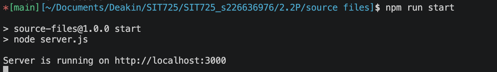
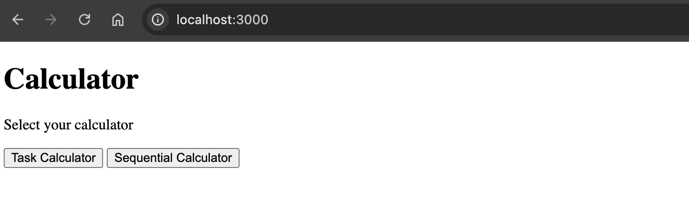
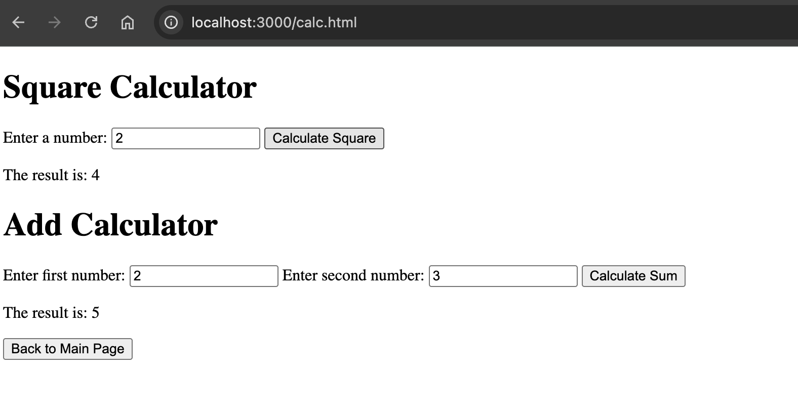
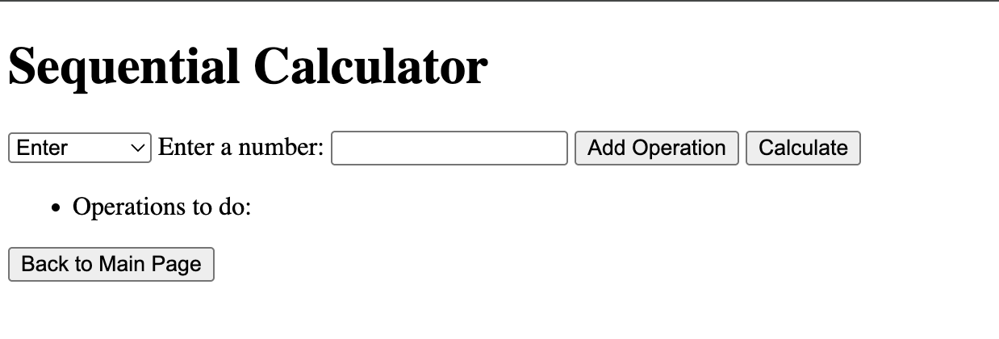
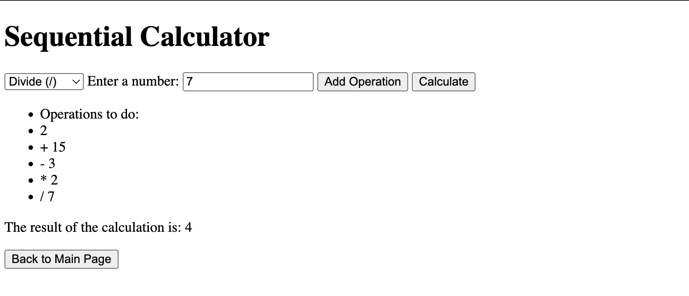

## Task 2.2P

For the task, it was developed a simple Express Web Server that can be executed using `npm run start` in the `source files` folder.

I introduced to the web server and `index.html` menu with the option of selecting two "calculators":
- "Task Calculator": This one includes the square function developed during the workshop and the add function to be developed for the task.

- "Sequential Calculator": A sequential calculator that enable the concatenation of basic operations (add, substract, multiply and divide) and then sends that as a string query parameter on a GET request to the server to calculate. It does not support parenthesis, so the calculations are done sequentially.

Assumptions:
- The user will only use numbers as inputs. If not, the result will be null