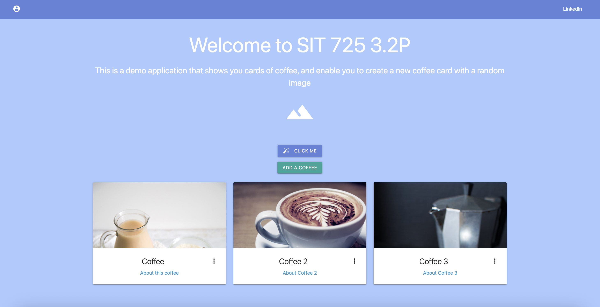
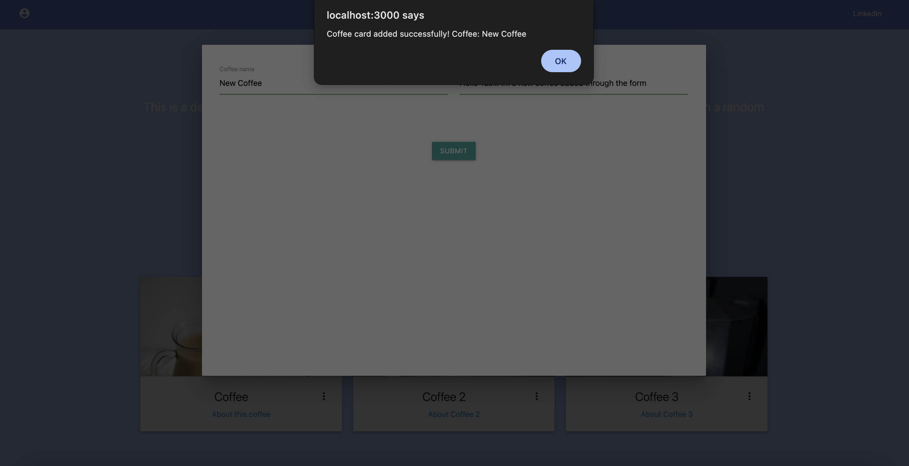

For the task, an example as the one showed in the workshop was developed, but in this case it shows coffee images in cards. 

For task purposes the background color was changed, and it was fixed the position of LinkedIn text, and the cards initialize with three fix images and cards in the same position. 

There is a `Add a coffee` button that helps us to add a new card, and works first with a form as follows: 

When the submit button is pressed, then it shows the following alert

This function what is does it to call a the submit-form endpoint in the server, that takes this data, fetches a random image from `https://coffee.alexflipnote.dev/random.json` (AlexFlipnote, 2025), and then return this data to the frontend to create a new card using the addCard() function. 

With that, now we have a new card that can be opened as follows. 

References: 

- AlexFlipnote. (2025). GitHub - AlexFlipnote/CoffeeAPI: ☕ An API that provides random coffee images. GitHub. https://github.com/alexflipnote/coffeeapi 
