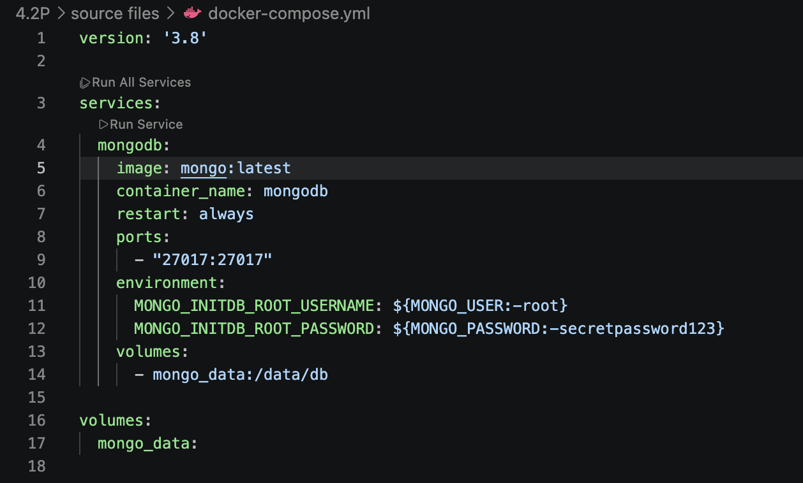
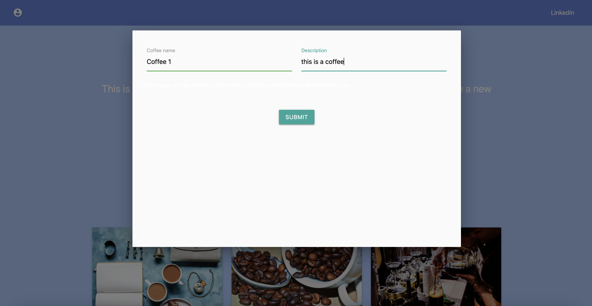
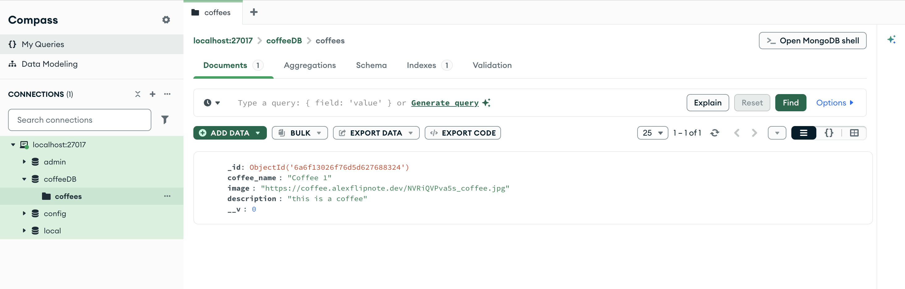
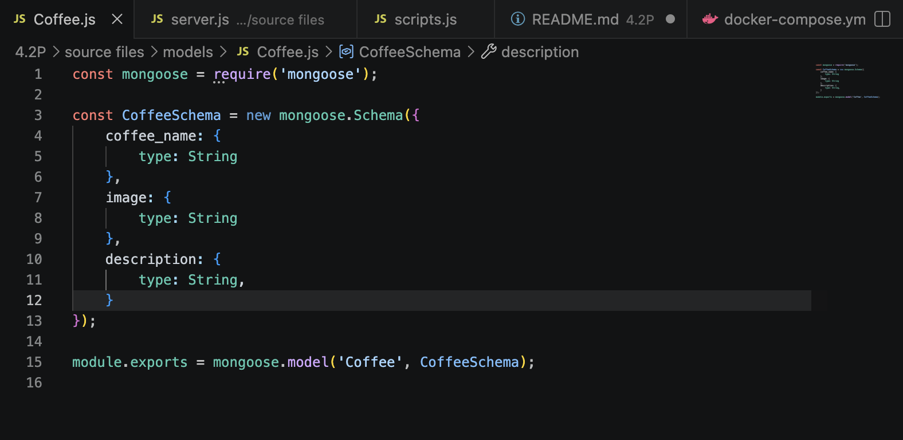
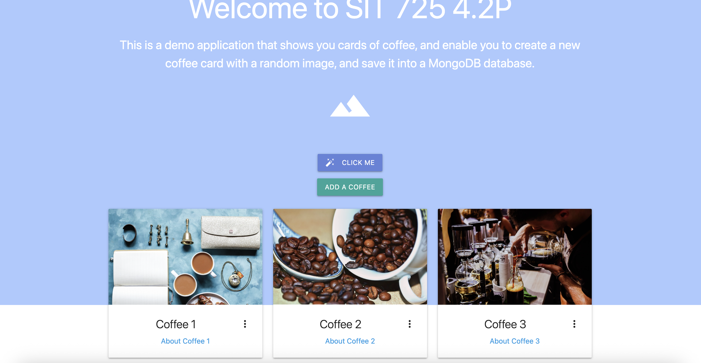
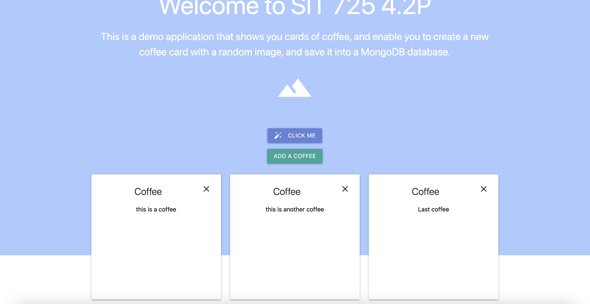

## Add a Database

For the task, a modified version of 3.1P task was developed, now connecting the `Add a Coffee` button to a MongoDB database 

Now, before showing the functionalities incorporated, is important to notice two points: 

- First, to ensure an easy deployment of the MongoDB database a docker-compose.yml was added, just initializing a database and storing a volume to persist the data. 

- To add a security perspective, an .env.example file was added, and an environment file integration was incorporated into all the files, making it available to define the database variables in a .env file, avoiding exposing sensible data. In any case, default values were added, so to run this code, this is completely optional. 

If we press the `Add a Coffee` button, we can fill a form to add a new coffee card. 

This will post data to the endpoint /submit-form triggering the fetching of a random image from https://coffee.alexflipnote.dev/random.json (AlexFlipnote, 2025) and adding the element to the MongoDB database using the mongoose model. 

This model was created into a models folder and then imported into the server.js file to avoid repeating code.

Finally, if we add enough items, this would be the view of our site with 3 coffees added to the database. 

References: 

1. AlexFlipnote. (2025). GitHub - AlexFlipnote/CoffeeAPI: ☕ An API that provides random coffee images. GitHub. https://github.com/alexflipnote/coffeeapi 

