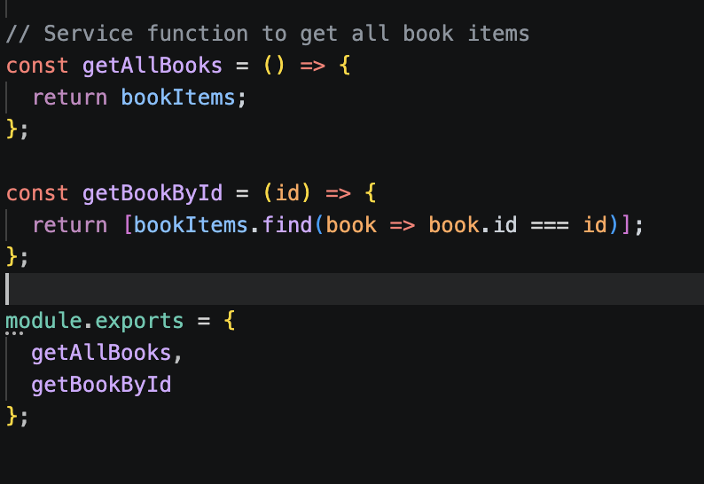
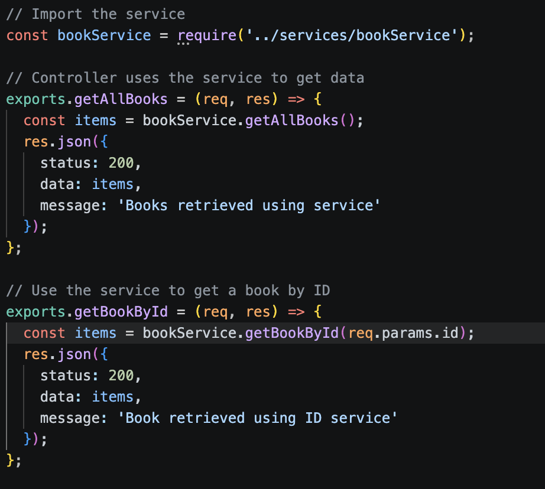
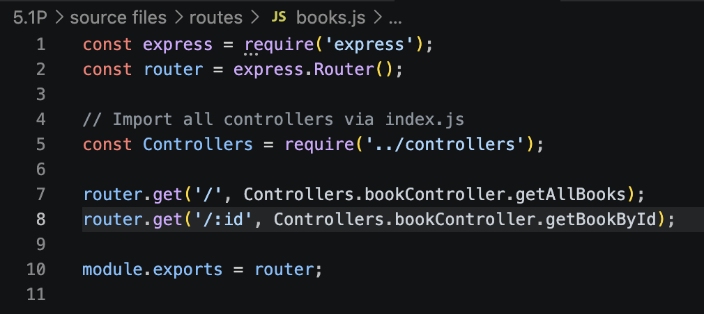
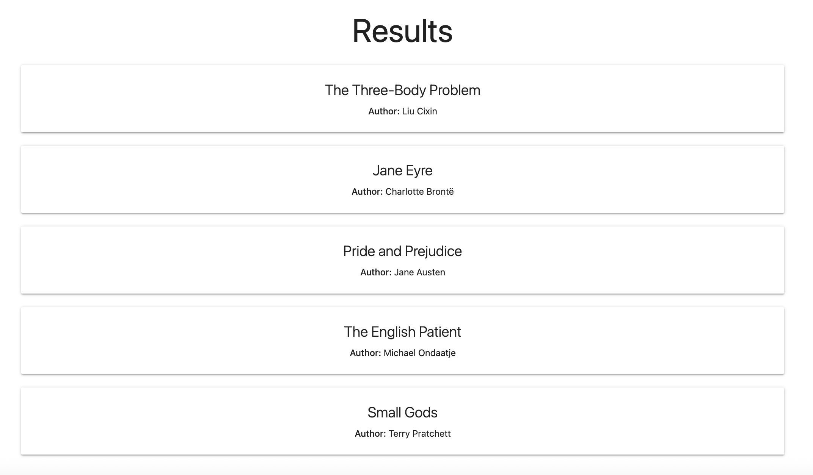
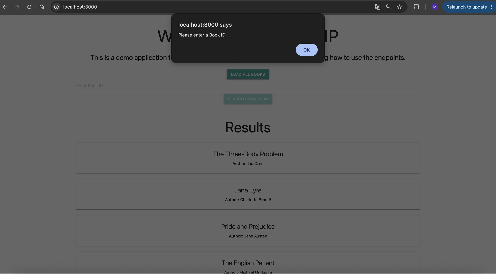
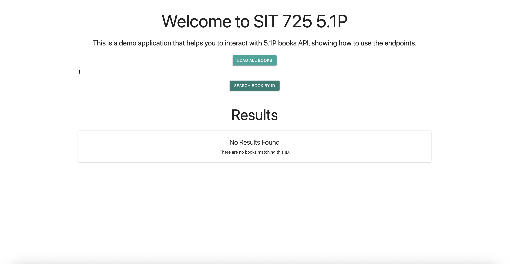
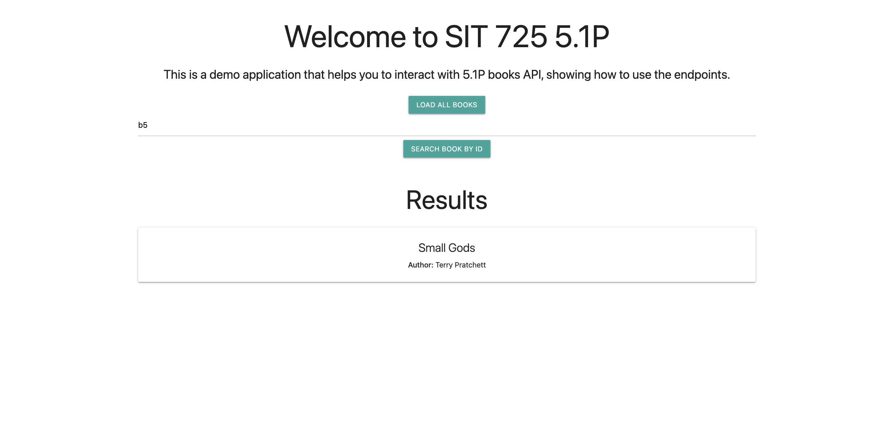

## 5.1P MVC

For the task, a modified version of week 5 workshop activity was developed, based on the code available at https://github.com/niroshini/sit725/tree/main/week5_4  

Using that API example, it was developed the following page, creating an public/index.html 

This page as soon as it renders, shows all the records available at the in-memory books list stored in service/bookService.js file. Each one of these records is displayed as a separate card, using the function getBookCards() in js/scripts.js. 

Then, the API is using Express framework and the MVC architecture showed in the workshop, where we have our services 

Where this bookService contains the logic to return the entire book list, or to use the find function to get books by ID. 

Then, importing the bookService file it is available the controller, where it is being defined the two functions that are going to be routed to retrieve all the books (getAllBooks()), or just one book by ID (getBookById()). 

Finally, the routes/books.js file is routing the GET requests to /api/books to getAllBooks function, or /api/books/:id to getBookbyId function as follows. 

With this, it is possible to first look for all the results displayed in the index page that are being displayed as soon as the page loads. 

If the user wants to use the ID search, needs to input a value in the text field available. If no input is used, the page triggers an alert as follows 

In addition to that, if the user input an ID that is not present in the list, the results container shows a card that signals that “No Results Found” 

And finally, if the user inputs a valid ID, then the results are shown as follows 

