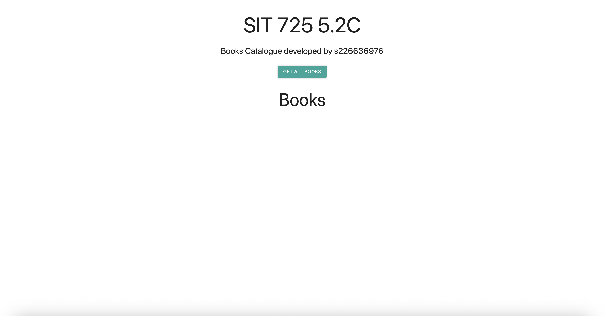
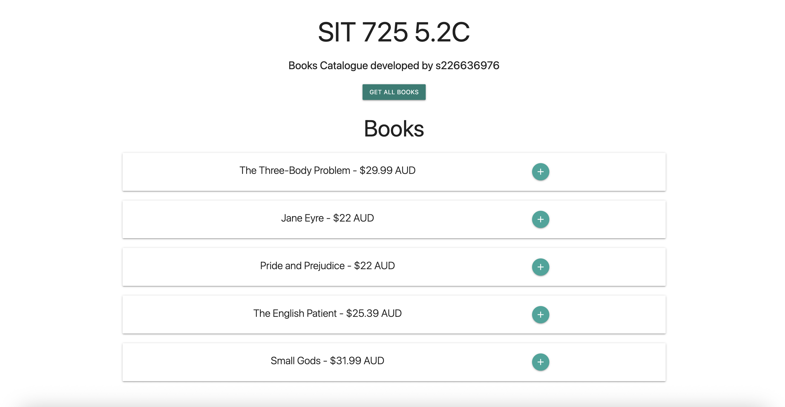
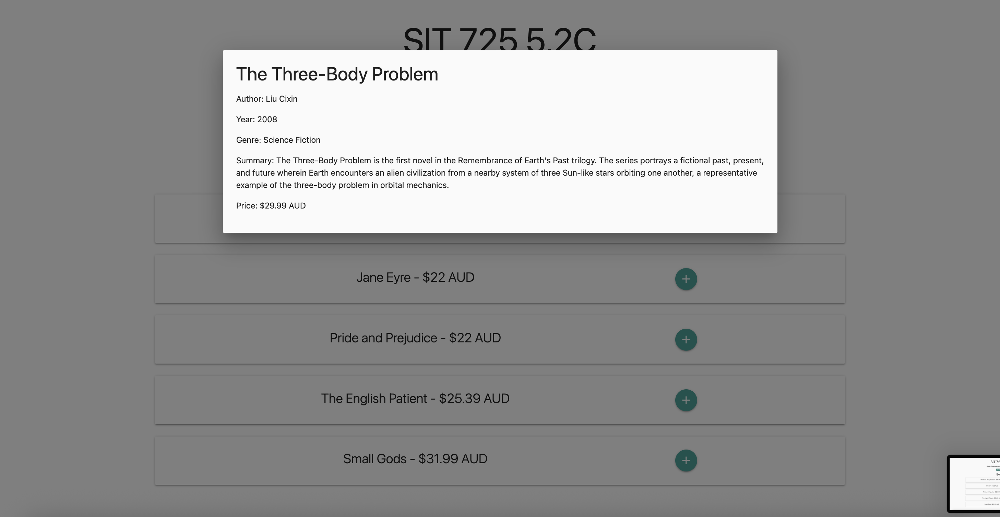
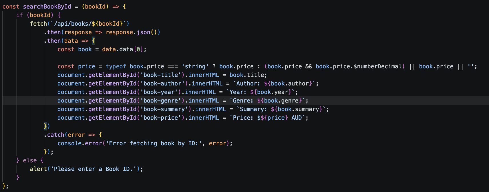
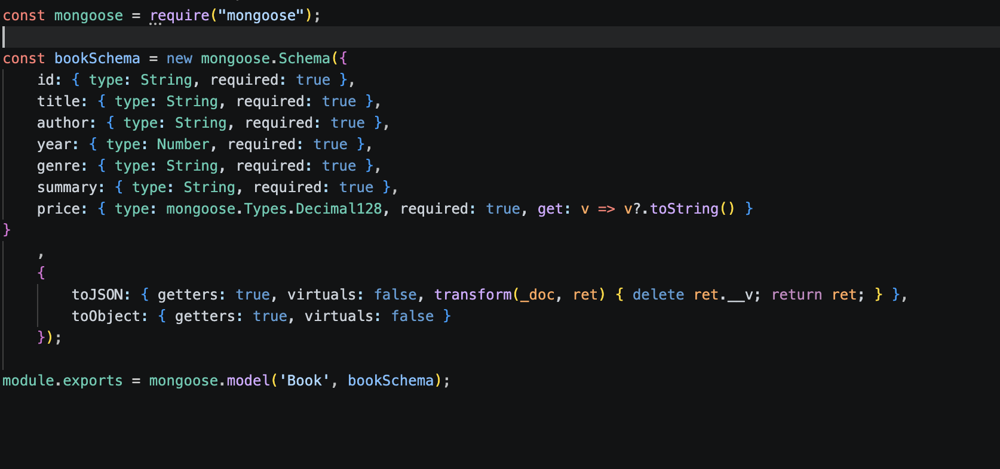
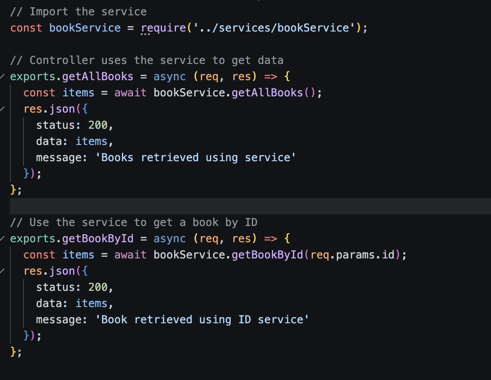
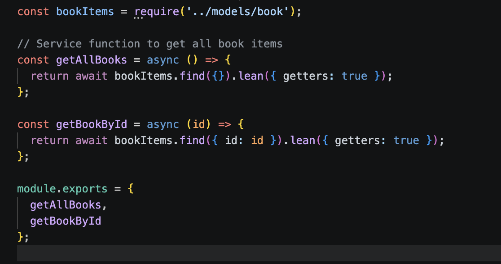

## 5.2C MVC + Database

This task was developed on top the previous task 5.1C available at https://github.com/maguzman6/SIT725_s226636976/tree/main/5.1P 

First, the UI was modified to follow the requirements of having a button to load all the books and then access the details of each one of them by clicking on them. 

For this last part, the book details were developed as a modal that opens once the user clicks on the ‘+’ sign in the book card. This works using the icon as a button that triggers the modal and executes the function searchBookById(), which also changes the text in the elements of the modal to the ones obtained from the API. 

Then, it is important to note for this task that a database was included instead of the in-memory list of books, and connection is being made in the server.js file. A model for the books was also developed in models/Book.js 

Where it is shown that we include the price of the books, and the format options toJSON and toObject, to use the price attribute as a string when it is transformed into these types.  

Finally, to use the elements in the database the controller was changed to support now an async function while the database query is happening 

And the bookService was modified to also support an async call, and now uses the mongoose model to execute the query to bring all the book elements, and to find a book by ID. 

