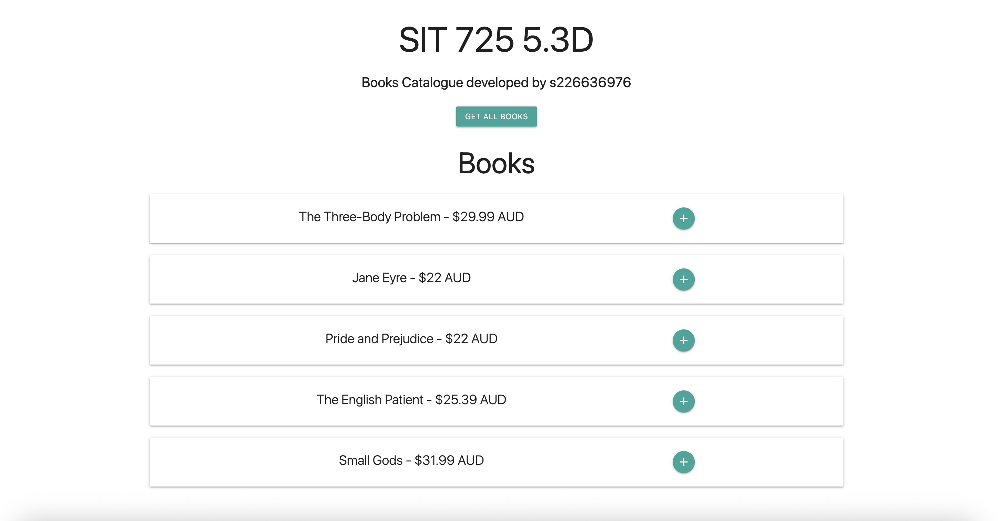
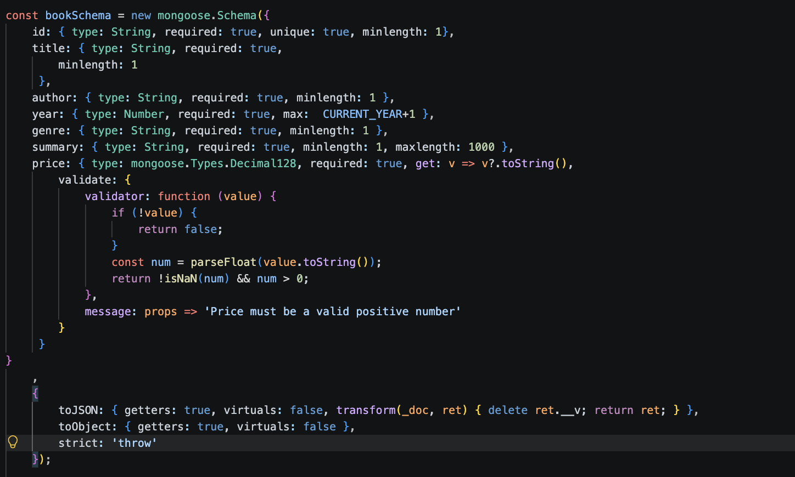
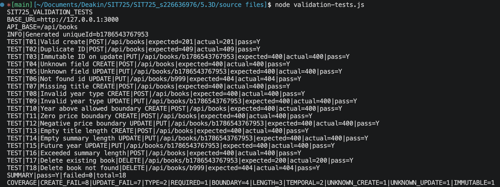

## 5.3D Apply Ethical Software Principles MVC + Database

This task was developed on top of the previous task 5.2C available at [SIT725_s226636976 Task 5.2C](https://www.google.com/search?q=https://github.com/maguzman6/SIT725_s226636976/tree/main/5.2C).

First, it is shown that the UI available at `localhost:3000` retains the same style as the one developed for Task 5.2C:




**Note:** For validation testing, the database must be running locally on `localhost:27017`. It must be pre-populated using the `scripts/seed.js` script, which creates an index for the `id` parameter.

## Book Schema Validation Rules

To apply validation rules to our Book Schema, the following code and validation rules were implemented:



| Field | Rule | Justification |
| --- | --- | --- |
| **id**<br> | 1. Required, non-empty, and unique key.<br> <br>2. Immutable on `UPDATE`. | 1. The `id` serves as the unique identifier for each book record. It is required, must be unique, and a book cannot be created with an empty `id`.<br><br>2. Once created, the `id` cannot be modified to ensure that each entity retains a fixed reference throughout its lifecycle. |
 | **title**<br> | Required, non-empty string.| Every book requires a title containing at least one character. This prevents books without titles from being created, displayed incorrectly, or confusing users.|
| **year**<br> | Required, `Number` type and maximum value restriction of next year (e.g., 2027 for this year).| Helps filter book data by year and enforces proper data types. Restricting the maximum value ensures temporal consistency by preventing books from being assigned unrealistic future publication dates, while still allowing legitimate future entries such as pre-releases.|
| **genre**<br> | Required, minimum length of one character.| Ensures proper category filtering across books. The minimum length condition ensures valid text input.|
| **summary**<br> | Required, minimum length of 1 character, maximum length of 1000 characters.| Necessary for displaying details on book detail cards. The length constraints prevent empty submissions while maintaining a clean, consistent UI layout.|
| **price**<br> | Required, `Decimal128` type enforced, value must be positive.| Using `Decimal128` avoids floating-point rounding errors. The custom schema validator converts the value to a float to verify that it is a valid, positive number for the catalog.|

It is also important to note that this schema enforces the option `strict: 'throw'`. This raises an error if an instance of the schema is initialized with extra/unregistered fields, ensuring safe writes and mitigating property injection attacks.

These validation rules enhance overall code quality by preventing unexpected API behaviors, handling objects with invalid types or unexpected fields, and delivering informative error messages to assist both users and developers.


## API Endpoints

To complement the schema validation rules described above, the API incorporates the following endpoints:

### 1. `POST /api/books` (Create Book)


Creates a new book entry after performing server-side validation:

* **201 Created:** The payload satisfies all schema rules and is successfully inserted into the database.


* **409 Conflict:** Returned if an attempt is made to create a book with a duplicate `id`.


* **400 Bad Request:** Returned if any field fails schema validation.


These status codes cover all user input scenarios: a success response (201), duplicate key handling (409), and client-side validation failures (400) accompanied by descriptive error messages detailing why the resource was not created.

The payload must be a JSON object as follows:

```json
{
  "id": "Valid ID",
  "title": "Valid Title",
  "author": "Valid Author",
  "year": 2020,
  "genre": "Other",
  "summary": "Valid summary text that satisfies your rules.",
  "price": "9.99"
}

```

The service extracts expected fields from the incoming payload. However, because of the `strict: 'throw'` setting, sending extra/unrecognized fields triggers a MongoDB error (Code 11000/validation error), which is caught by the controller and returned as an HTTP response.

---

### 2. `GET /api/books/:id` (Read Book By ID)


Retrieves a specific book by its `id`.

* **200 OK:** The `id` matches an existing record, and data retrieval was successful.


* **404 Not Found:** Returned when no matching book ID is found.


---

### 3. `PUT /api/books/:id` (Update Book)


This endpoint updates an existing book record matching a specific `id`. This can return:

* **200 OK:** If an update was executed successfully.


* **404 Not Found:** Returned when there is no record associated with the given `id`.


* **400 Bad Request:** Returned when validation on any field fails.


The payload for this endpoint is a JSON object:

```json
{
  "title": "Updated Title",
  "author": "Updated Author",
  "year": 2021,
  "genre": "Other",
  "summary": "Updated summary text.",
  "price": "10.50"
}

```

The update payload mirrors the `POST` payload structure, except it excludes the `id` field, preventing errors caused by trying to modify an immutable field.

---

### 4. `DELETE /api/books/:id` (Delete Book)


Deletes a specific book record by `id`. This endpoint completes the standard CRUD operations (Create, Read, Update, Delete) and allows validation tests to clean up created data without polluting the database.

* **200 OK:** The `id` is found, and the record is deleted.


* **404 Not Found:** Returned when no matching book ID is found.


---

### Notes:

1. Read and Delete endpoints do not require safe-write validation rules as they do not perform write operations; however, they complete the CRUD requirements for book records.


2. The valid book and valid update JSON payloads in `validation-test.js` were left unchanged as they already follow all schema rules.


---

## Validation Testing Results

Finally, `validation-test.js` was extended to enforce the validation rules testing creating and updating records, such as:

* **T06:** 404 error when updating a not found `id` record


* **T07:** 400 error creating a record with missing `title` field


* **T08:** 400 error creating a record with `year` field as string


* **T09:** 400 error updating a record with `year` field as string


* **T10:** 400 error creating a record with a `year` above maximum value


* **T11:** 400 error creating a record with a zero-value `price`

* **T12:** 400 error updating a record with a negative value `price`

* **T13:** 400 error creating a record with an empty string as `title`

* **T14:** 400 error updating a record with an empty string as `summary`

* **T15:** 400 error updating a record with a `year` above maximum value


* **T16:** 400 error creating a record with a `summary` with more than 1000 characters


* **T17:** 200 success code deleting a book with an existing ID


* **T18:** 404 error deleting a book with a not found `id`


Having these results as the `validation-test.js` file is executed:


