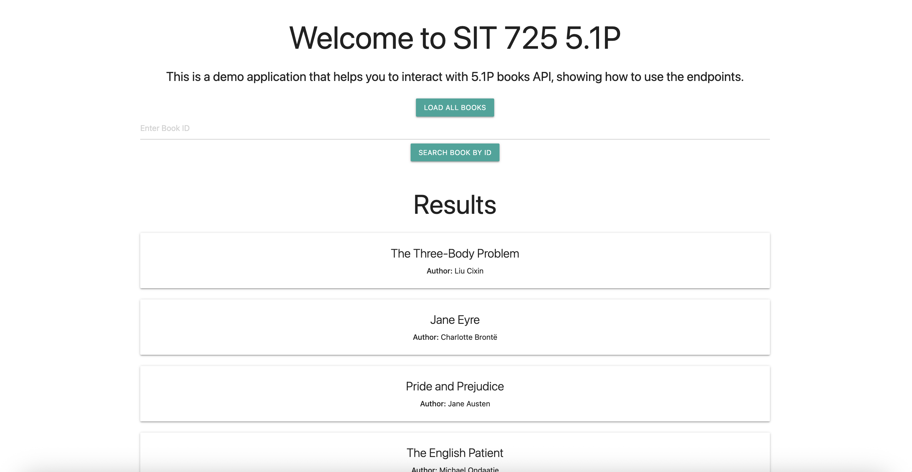
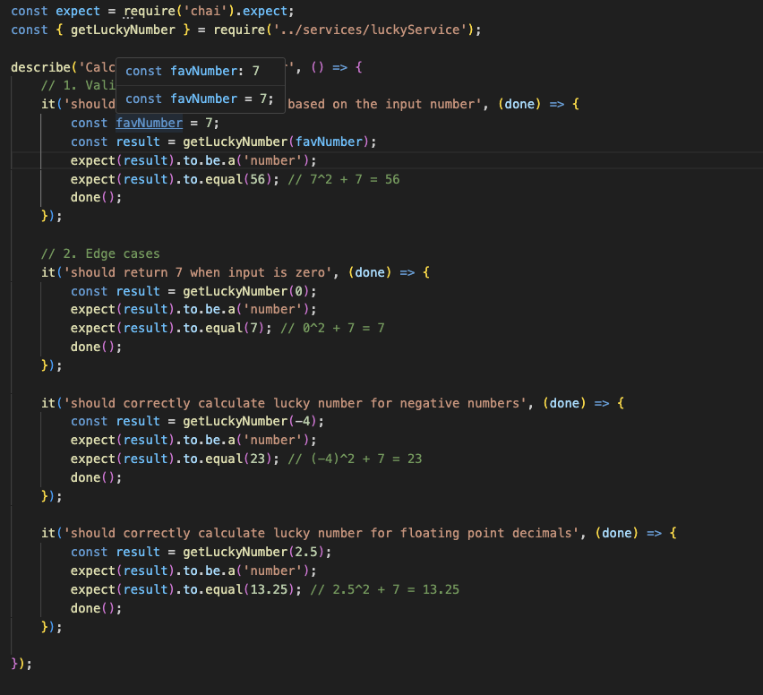
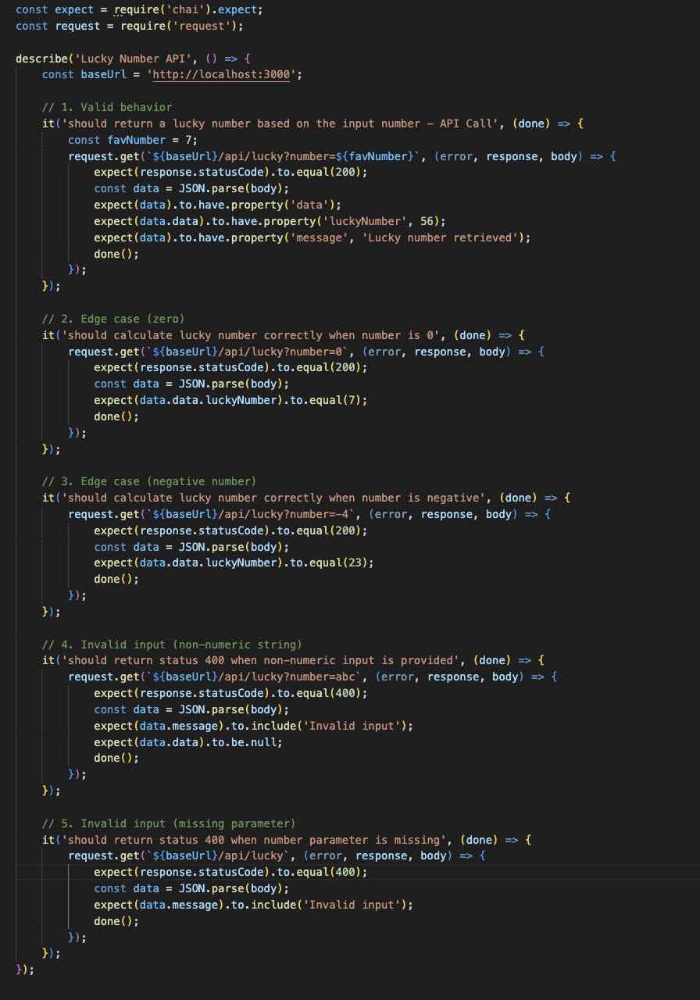
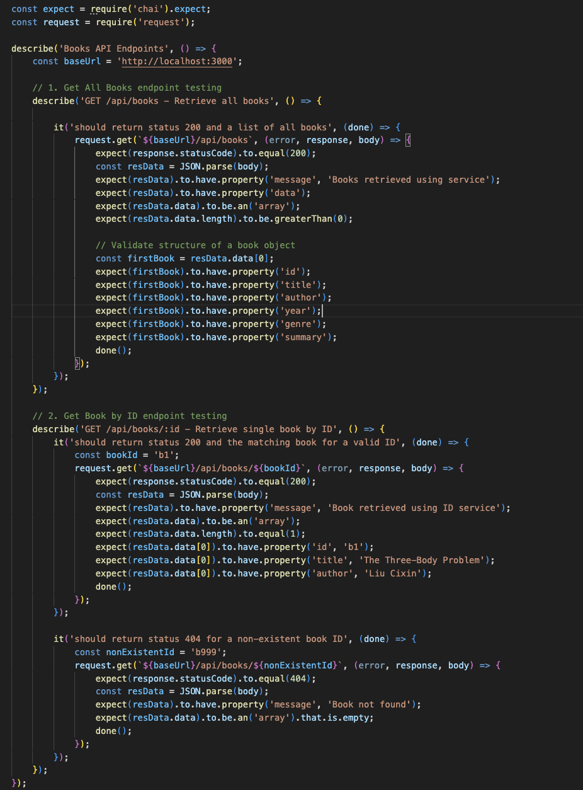
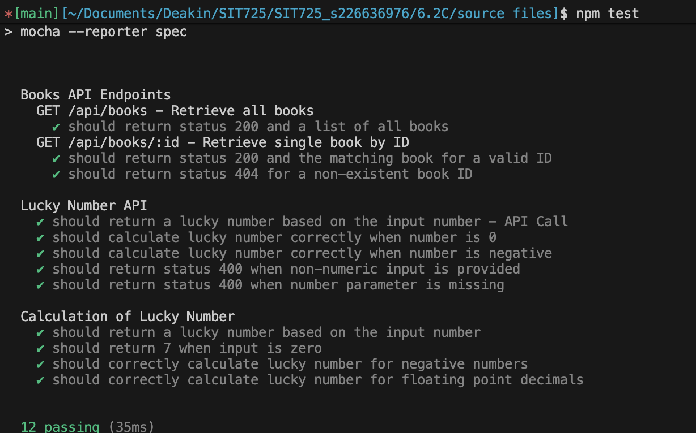

## 6.2C Testing your Code

For the task, a modified version of 5.1P activity was developed, based on the code available at https://github.com/maguzman6/SIT725_s226636976/tree/main/5.1P

In that task, the UI shows the list of books stored in memory as follows

And for testing purposes a new endpoint was added, that can be tested with this UI form named “Get your lucky number” that takes the number input and get the square of that number plus 7. (e.g. getLuckyNumber(7) = 7^2 + 7 = 56)

Now, we have three endpoints to be tested named:

1. `GET /api/books`
2. `GET /api/books/:id`
3. `GET /api/lucky?number`

Where this last one is the dummy endpoint added to use testing over a calculation endpoint.

Then, for each one of them it was added some test as follows

**Lucky API**: First we perform tests over just the getLuckyNumber function to test the behaviour as follows, testing edge cases such as receiving a zero, negative values or floating point decimals.

At the same time, it is tested this behaviour in the API call, adding checking over getting a 400 error code for missing values or non numeric input

**Books API**: The endpoint is tested around getting a valid response from the in-memory list, where each book should have all the required parameters. Then, the same behaviour is tested for the search by ID, but in this case is also tested that we should receive a 404 status code when the ID is not found.

Finally, running the npm test command in the terminal we get this following result

